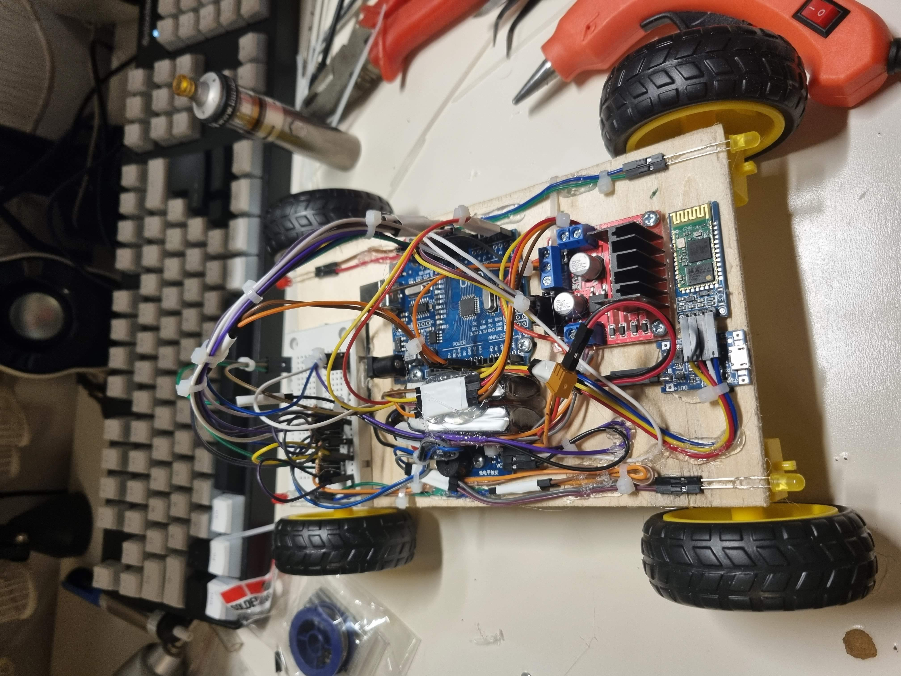

# Bluetooth Controlled Robot

Authors: Ugur Taysi & Atif Ghani

This repository contains the design and code for a Bluetooth controlled robot, specifically a Remote Control (RC) car. The robot utilizes Bluetooth technology to enable control via an Android device.

The project represents a practical application of embedded systems programming, demonstrating the integration of hardware components - including motors, batteries, and Bluetooth modules - with software implemented in the Arduino programming language.

## Materials and Components

The components used in the project and their respective purposes are as follows:

• DC Motor (4x): These are used to rotate the wheels of the robot, thereby enabling its
movement.

• Wheel (4x): These are attached to the motors, allowing the robot to move.

• 20x12cm Wooden Board: Used as the chassis for the robot, providing a base to attach other
components.

• LED (2x Red, 2x Yellow): Used for illumination and the stress signal.

• Arduino Uno: The main controller unit that connects each part and allows programming.

• Buzzer: Used for the horn and stress signal.

• Breadboard: We used a breadboard for making easier additional circuit connections.

• Li-Po Battery (2x in series): Used to power the system.

• TP4056 Charging Module: Charges the batteries via a micro-USB cable.

• HC06 Bluetooth Module: Allows Bluetooth connection which is the main method for
connecting to the remote.

• L298N Controller Module: A controller between each motor and the Arduino. Allows us to
program accordingly.

• 220Ω Resistor (4x): Required for each LED to control the current flow.

• Jumper Cables: Connects each component together.

## Circuit Diagram

